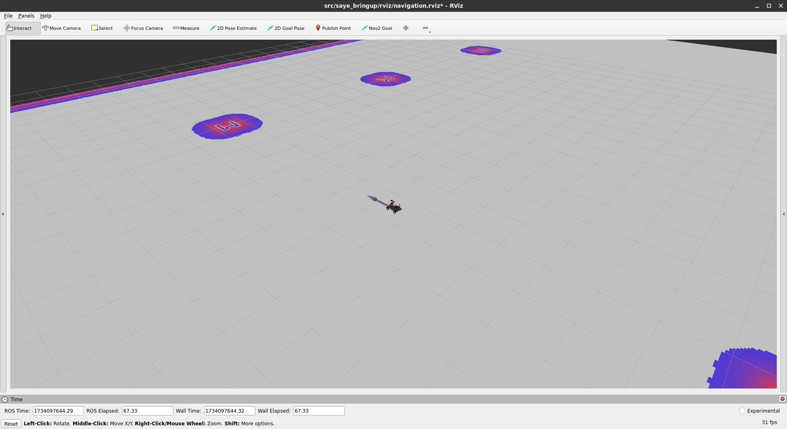
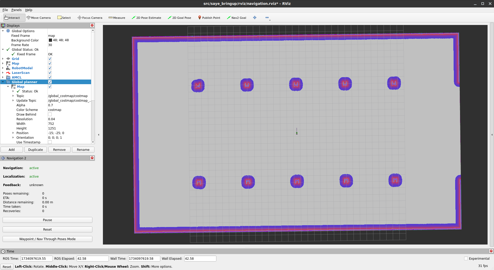

# Ackermann Steering Vehicle Simulation in ROS2 with Gazebo Sim Harmonic

This project features the simulation of a custom vehicle with **Ackermann steering capabilities**, developed using **ROS2** and the **Gazebo Sim Harmonic environment**. The model integrates a variety of sensors and navigation tools for autonomous operation, making it one of the first implementations of an Ackermann steering vehicle in this simulation framework.

## Table of Contents

- [Ackermann Steering Vehicle Simulation in ROS2 with Gazebo Sim Harmonic](#ackermann-steering-vehicle-simulation-in-ros2-with-gazebo-sim-harmonic)
- [Features](#features)
  - [1 Ackermann Steering](#1-ackermann-steering)
  - [2 ROS2 Communication](#2-ros2-communication)
  - [3 Sensors](#3-sensors)
  - [4 Navigation](#4-navigation)
  - [5 Manual Control with external joystick](#5-manual-control-with-external-joystick)
  - [6 Visualization](#6-visualization)
- [Requirements](#requirements)
- [Local Installation](#local-installation)
- [Docker Installation](#docker-installation)
- [Usage](#usage)
  - [1 Basic Simulation and Manual Control](#1-basic-simulation-and-manual-control)
  - [2 SLAM Simultaneous Localization and Mapping](#2-slam-simultaneous-localization-and-mapping)
  - [3 Navigation with Nav2](#3-navigation-with-nav2)
- [Future Work](#future-work)
- [Gallery](#gallery)
- [TF Tree](#tf-tree)
- [Star History](#star-history)

### If you like this project, consider giving it a ⭐ to show your support!
## Features

### 1. **Ackermann Steering**

- A custom vehicle model built with realistic Ackermann steering dynamics for accurate maneuverability.

### 2. **ROS2 Communication**

- All sensor data and control signals are fully integrated into the ROS2 ecosystem for seamless interoperability.

### 3. **Sensors**

- **IMU**: Provides orientation and angular velocity.
- **Odometry**: Ensures accurate vehicle state feedback.
- **LiDAR**: Mounted for obstacle detection and environmental scanning.
- **Cameras**:
  - Front-facing
  - Rear-facing
  - Left-side
  - Right-side
  > **Note:** By default, only the front camera is bridged to ROS 2.If you want to use all cameras (left, right, rear) in ROS 2,remove the `#` at the beginning of the relevant camera sections in `saye_bringup/config/ros_gz_bridge.yaml` to activate them  (e.g., `/camera/left_raw`, `/camera/right_raw`, `/camera/rear_raw`).

### 4. **Navigation**

- Integrated with the **Nav2 stack** for autonomous navigation.
- **AMCL (Adaptive Monte Carlo Localization)** for improved positional accuracy.
- **SLAM** techniques implemented for real-time mapping and understanding of the environment.
- Fine-tuned parameters for optimized navigation performance.

### 5. **Manual Control (with external joystick)**

- Added support for joystick-based manual control in the simulation environment, enabling users to test vehicle movement interactively.

### 6. **Visualization**

- Full model and sensor data visualization in **RViz2**, providing insights into robot states and environmental feedback.

## Requirements

- **ROS2 (Humble)**
- **Gazebo Sim Harmonic**
- **RViz2**
- **Nav2**

## Local Installation

0. Your need to sure that installation of Gazebo Harmonic and ROS (ros_gz):<br>
   `sudo apt-get install ros-${ROS_DISTRO}-ros-gz`<br>
   `sudo apt-get install ros-humble-ros-gzharmonic` (Only Humble version)<br>
   More details about installation Gazebo and ROS: <a href="https://gazebosim.org/docs/latest/ros_installation/">Link</a>
1. Clone the repository:<br>
   `mkdir -p ackermann_sim/src && cd ackermann_sim/src`<br>
   `git clone https://github.com/alitekes1/ackermann-vehicle-gzsim-ros2`<br>`cd ..`
2. Build the project:
   `colcon build && source install/setup.bash`
3. Set environment variables:
   ```bash
   # Set environment variables for current session
   export GZ_SIM_RESOURCE_PATH=$GZ_SIM_RESOURCE_PATH:/your/path/ackermann_sim/src/ackermann-vehicle-gzsim-ros2/
   export ROS_PACKAGE_PATH=$ROS_PACKAGE_PATH:/your/path/ackermann_sim/src/ackermann-vehicle-gzsim-ros2/
   ```

   **For Permanent Setup:**
   
   To make these environment variables permanent, add them to your `.bashrc` file:
   ```bash
   # Add environment variables to .bashrc
   echo 'export GZ_SIM_RESOURCE_PATH=$GZ_SIM_RESOURCE_PATH:/your/path/ackermann_sim/src/ackermann-vehicle-gzsim-ros2/' >> ~/.bashrc
   echo 'export ROS_PACKAGE_PATH=$ROS_PACKAGE_PATH:/your/path/ackermann_sim/src/ackermann-vehicle-gzsim-ros2/' >> ~/.bashrc
   
   # Apply changes
   source ~/.bashrc
   ```

   > **Note:** Replace `/your/path/` with your actual installation path.

## Docker Installation

You can also run the simulation using Docker, which ensures a consistent environment across different systems.

### Prerequisites
- Docker
- Docker Compose
- NVIDIA Container Toolkit (for GPU support)

### Steps to Run with Docker

1. Clone the repository:
   ```bash
   mkdir -p ackermann_sim/src && cd ackermann_sim/src
   git clone https://github.com/alitekes1/ackermann-vehicle-gzsim-ros2
   cd ackermann-vehicle-gzsim-ros2
   ```

2. Build and run the Docker container:
   ```bash
      docker run -it \
      --name ackermann_sim \
      --hostname ackermann_sim \
      --env="DISPLAY=$DISPLAY" \
      --env="QT_X11_NO_MITSHM=1" \
      --volume="/tmp/.X11-unix:/tmp/.X11-unix:rw" \
      --privileged alitekes1/ackermann_sim:latest
   ```

3. If you want to additional terminal for same container
   ```bash
      docker exec -it ackermann_sim bash
   ```

   
> **Note:** Inside the container, you can run the simulation commands as normal.

## Usage

### 1. Basic Simulation and Manual Control

1.  Launch the simulation:
    ```bash
    ros2 launch saye_bringup saye_spawn.launch.py
    ```
2.  Control car:
    ```bash
    ros2 run teleop_twist_keyboard teleop_twist_keyboard
    ```

### 2. SLAM (Simultaneous Localization and Mapping)

-   To run SLAM Toolbox for mapping, launch the following after starting the simulation:
    ```bash
    ros2 launch saye_bringup slam.launch.py
    ```
    [](https://www.youtube.com/watch?v=QWcJ9TlqFOU "Proje Tanıtımı")

### 3. Navigation with Nav2

-   To run the simulation with the Nav2 stack for autonomous navigation, launch the following after starting the simulation:
    ```bash
    ros2 launch saye_bringup navigation_bringup.launch.py
    ```
    [](https://www.youtube.com/watch?v=SJ4NrbdlNZo "NAV2")

> **Note:** The YouTube videos above are played at 4x speed. You can reach the videos by click on the images.

## Future Work

1. **Deep Reinforcement Learning (DRL):**
   - Train the vehicle to handle complex scenarios autonomously using advanced DRL algorithms.
2. **Enhanced Features:**
   - Explore additional sensor configurations and navigation strategies.

## Gallery


| **Gazebo Sim Harmonic**                                                                                                     | **RViz2**                                                                                                                   |
| --------------------------------------------------------------------------------------------------------------------------- | --------------------------------------------------------------------------------------------------------------------------- |
|  |  |
|  |  |
|                                                                                          |                                                                                     |

## TF Tree


---

## Star History

<a href="https://www.star-history.com/#alitekes1/ackermann-vehicle-gzsim-ros2&Date">
 <picture>
   <source media="(prefers-color-scheme: dark)" srcset="https://api.star-history.com/svg?repos=alitekes1/ackermann-vehicle-gzsim-ros2&type=Date" />
   <source media="(prefers-color-scheme: light)" srcset="https://api.star-history.com/svg?repos=alitekes1/ackermann-vehicle-gzsim-ros2&type=Date" />
   
 </picture>
</a>
